# DocaPrise

## Overview
DocaPrise is an AI-powered contract generation and signing platform that simplifies the creation, management, and execution of legal documents. It helps enterprises save time by providing reusable, up-to-date contract templates and automating the signing process.

## Inspiration
Manually drafting and signing contracts is time-consuming, error-prone, and inefficient. We wanted to create a smarter way for businesses to manage contracts—one that leverages AI and automation to improve accuracy and reduce repetitive tasks.

## Features
- **AI-Powered Contract Generation**: Generate contracts dynamically using LLMs for accuracy and customization.
- **Reusable Templates**: Save and repopulate contract fields to avoid retyping information.
- **Detailed Data Input**: Collect precise information with structured dynamic forms.
- **Multiple Signing Options**: Supports embedded signing, responsive signing, and remote signing via email.
- **Secure & Scalable**: Uses JWT authentication and a robust database for document storage.

## How It Works
1. **Create a Contract**: Use our dynamic form to input contract details.
2. **Save & Reuse**: Store contract data for future use.
3. **Choose a Signing Method**:
   - **Embedded Signing**: Sign directly within the platform.
   - **Responsive Signing**: Adaptable signing experience across devices.
   - **Remote Signing**: Email-based signing for external parties.
4. **Finalize & Store**: Signed contracts are securely saved for reference.



## Tech Stack
- **Frontend**: Next.js (React) with a responsive UI.
- **Backend**: Node.js with TypeScript for strong typing and maintainability.
- **Authentication**: JWT-based authentication for secure access.
- **AI Model**: LLM integration for contract generation and editing.
- **Database**: Document storage and retrieval system.
- **DocuSign APIs**: Leveraging multiple endpoints for seamless contract execution.

## Challenges We Faced
- Setting up **authentication** securely and efficiently.
- Implementing **TypeScript** in Next.js for backend development.
- Ensuring accurate contract generation with AI.

## Accomplishments We Are Proud Of
- Successfully using **LLMs to generate repeatable and accurate contract documents**.
- Implementing **multiple signing options** to provide flexibility.
- Creating a **user-friendly contract management system**.

## What We Learned
- How to integrate **DocuSign APIs effectively** for different signing methods.
- The importance of **structured data input** for AI-generated contracts.
- Advanced **TypeScript best practices** for scalability and maintainability.

## What's Next for DocaPrise
- **Expand AI capabilities** to enhance contract personalization.
- **Integrate smart analytics** to track contract usage and improvements.
- **Support more document formats** beyond standard contracts.
- **Improve collaboration tools** for multi-user contract editing.

## Getting Started
### Prerequisites
- Node.js (v16+)
- Next.js (latest version)
- DocuSign Developer Account
- OpenAI API Key (for AI-powered features)

### Frontend Setup
1. Clone the frontend repository:
   ```sh
   git clone https://github.com/your-repo/docaprise-frontend.git
   cd docaprise-frontend
   ```
2. Add the following to your `.env.local` file:
   ```sh
   NEXT_PUBLIC_BASE_URL=http://localhost:3001/api
   ```
3. Install dependencies:
   ```sh
   npm install
   ```
4. Start the development server:
   ```sh
   npm run dev
   ```

### Backend Setup
1. Clone the backend repository:
   ```sh
   git clone https://github.com/your-repo/docaprise-backend.git
   cd docaprise-backend
   ```
2. Follow the instructions at [DocuSign Quickstart](https://developers.docusign.com/docs/esign-rest-api/quickstart/) to download credentials for your own environment.
3. Replace the values in `appsetting.example.json` with your own credentials, including replacing the private key.
4. Install dependencies:
   ```sh
   npm install
   ```
5. Start the backend server:
   ```sh
   npm run dev
   ```

## Contributing
We welcome contributions! Feel free to fork the repository, create a branch, and submit a pull request with improvements.

## License
This project is licensed under the MIT License - see the [LICENSE](LICENSE) file for details.

## Contact
For any inquiries, reach out to our team at **contact@docaprise.com**.

